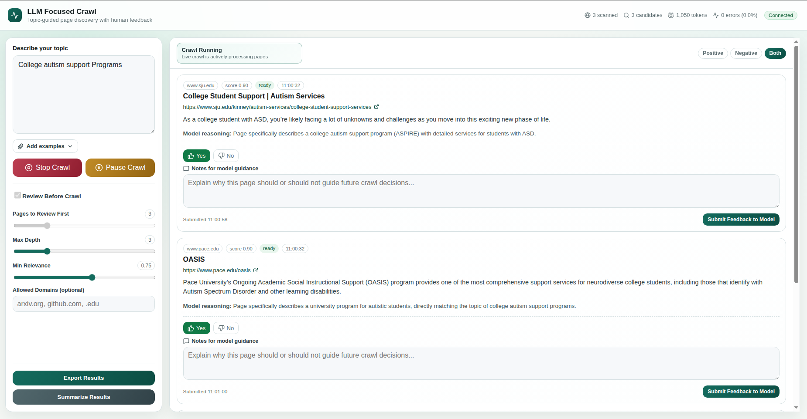

# Web-Data-Discovery

Source artifact for **"A Demo of Interactive Thematic Data Collection on the Live Web"** (Michael West and Eduard Dragut, PVLDB 19(1), 2026), a demonstration of an interactive, multi-agent focused-crawling system for building thematic collections of web pages with human-in-the-loop relevance and steering feedback.

Video: [https://youtu.be/KaTpDo-g47s](https://www.youtube.com/watch?v=NCP717nKkT8)



## System Overview

The system decomposes thematic web-data collection into three cooperating LLM-driven agents — a Query Agent, a Relevance Agent, and a Navigation Agent — operating within a dynamic re-seeding loop that periodically re-enters the web through newly generated search queries. A browser-based interface exposes the discovery process to users, who can inspect intermediate results, correct relevance judgments, and provide steering feedback that directly influences system behavior.

This repository contains the two halves of the demo system:

- [`backend/`](backend/) — Python/FastAPI asynchronous backend implementing the focused-crawling BFS loop, the three agents, session management, human-in-the-loop feedback endpoints, and artifact export. Agents are implemented against the DeepSeek-V3.1 API.
- [`frontend/`](frontend/) — React web interface for defining a collection task, reviewing streamed results, and providing relevance corrections and steering feedback.

Each subdirectory has its own README with setup and run instructions; start with `backend/README.md` to configure API keys, then `frontend/README.md` to run the UI against it.

## Status of This Artifact

This is a research-demo artifact, not a packaged product. It assumes a programmer comfortable with Python/Node environment setup, and it requires your own API keys (a search API and an LLM API) to run — it will not do anything useful out of the box without those. It is provided to support reproducibility and inspection of the system described in the paper, exactly as implemented for the demonstration.

## Citation

```bibtex
@article{west2026thematic,
  title     = {A Demo of Interactive Thematic Data Collection on the Live Web},
  author    = {West, Michael and Dragut, Eduard},
  journal   = {Proceedings of the VLDB Endowment},
  volume    = {19},
  number    = {1},
  year      = {2026}
}
```

## License

MIT — see [LICENSE](LICENSE).
